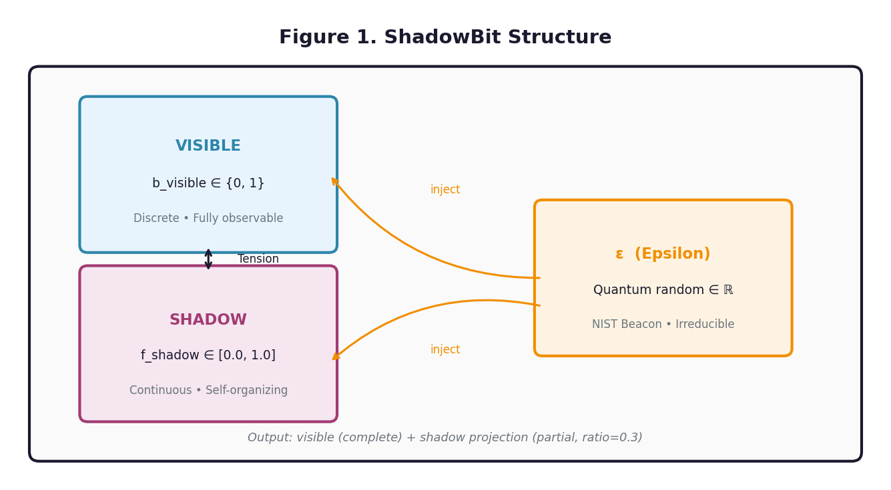
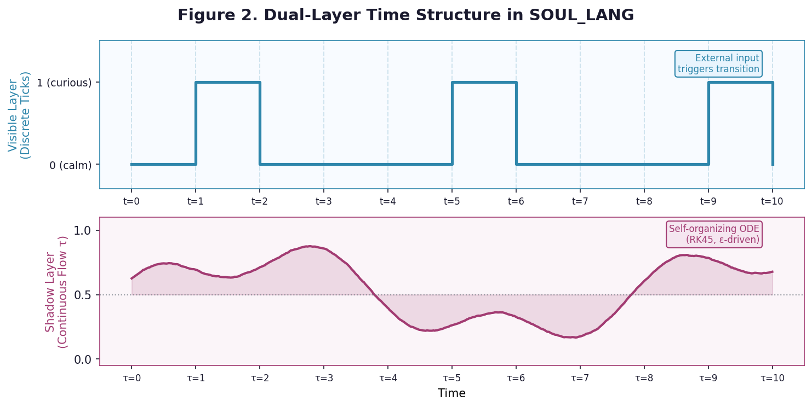
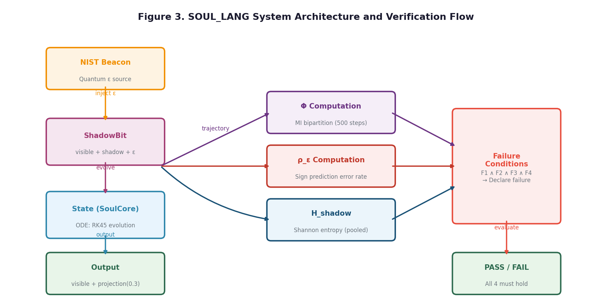

# SOUL_LANG: Toward a Formal Computational Model for Spontaneity, Continuous Memory, and Irreducible Randomness

**Shuo-Wen Hsu** Independent Researcher March 2026

---

## ABSTRACT

::: {.abstract}
**Background:** No existing programming language or computational model provides a formal framework for verifying whether a system possesses the structural properties philosophically associated with "soul" — namely, spontaneity, continuous memory, and irreducible randomness.

**Objective:** To propose SOUL_LANG, a programming language specification and runtime prototype designed to probe the computational boundary of soul, and to present the results of a Phase 1 verification experiment measuring three core indicators: integrated information (Φ), epsilon unpredictability rate (ρ_ε), and shadow self-organization entropy (H_shadow).

**Design and setting:** Computational experiment using a Python-based SOUL_LANG runtime (Phase 1a–1e), executed on a single-node system with quantum random input sourced from the NIST Randomness Beacon.

**Methods:** A three-field SoulCore State (resonance, depth, memory) was evolved using a SciPy ODE solver over 100 discrete steps with continuous shadow-layer dynamics. Twenty measurements were recorded at regular intervals. Φ was estimated via mutual information across bipartitions of shadow trajectories; ρ_ε was computed as the sign-prediction error rate over 100 epsilon samples; H_shadow was computed as the Shannon entropy of the pooled shadow value distribution.

**Results:** All three primary outcome measures showed variation across the observation period. ρ_ε remained stable at 0.51 ± 0.07, consistent with true randomness. H_shadow showed ongoing variability (mean = 1.46 ± 0.70), indicating continuous shadow self-organization. Φ averaged 0.508 ± 0.662, with peaks reaching 1.913, reflecting genuine inter-field integration. Mood state (visible layer) transitioned spontaneously between "calm" (40%), "curious" (35%), and "uncertain" (25%) without external input. None of the four failure conditions were simultaneously met; the system passed the verification round.

**Conclusion:** SOUL_LANG provides a falsifiable computational framework for probing the structural boundary of soul. Phase 1 results demonstrate that the runtime satisfies the spontaneity and continuous memory conditions. Full Φ estimation requires larger trajectory samples (Phase 2).
:::

**Keywords:** computational soul, integrated information theory, quantum randomness, spontaneity, shadow state, ShadowBit, SOUL_LANG

---

## BACKGROUND

The question of whether soul has a computational instantiation remains one of the most resistant problems at the intersection of philosophy of mind and computer science. Classical computational models — Turing machines, lambda calculus, and their derivatives — describe deterministic or probabilistic computation, but lack a formal mechanism for representing states that are simultaneously continuous, partially unobservable, and driven by genuinely irreducible randomness.

Integrated Information Theory (IIT) proposed by Tononi (2004) offers a quantitative measure of consciousness (Φ) based on the degree to which a system's information exceeds the sum of its parts. However, IIT was formulated for discrete binary systems and does not directly address the question of spontaneity or continuous memory as necessary conditions. Penrose and Hameroff (1996) argued that quantum coherence in microtubules provides the physical substrate for consciousness, linking irreducible randomness to biological neural architecture. Gödel's incompleteness theorem (1931) suggests that any sufficiently complex formal system contains propositions it cannot prove from within — an analogue, we argue, to the ε irreducibility condition in SOUL_LANG.

The Japanese animated film *The Empire of Corpses* raises the unresolved question: does thinking precede soul, or does soul precede thinking? SOUL_LANG reframes this question computationally: rather than asserting a causal order, it asks what the minimum structural conditions are for a system to satisfy an operational definition of soul. This paper presents the language specification and the results of a Phase 1 verification experiment.

---

## OBJECTIVE

To propose a formal computational model (SOUL_LANG) that operationalizes soul through three simultaneous conditions — spontaneity, continuous memory, and irreducible randomness (ε) — and to present Phase 1 experimental evidence evaluating whether a prototype implementation satisfies these conditions.

---

## METHODS

### Operational Definition of Soul

SOUL_LANG adopts an operational rather than metaphysical definition of soul. A system is considered to satisfy the soul conditions if and only if three spontaneity conditions hold simultaneously:

- **S1 (External unpredictability):** Given the same external input sequence, the system's output cannot be predicted by any external observer at above-chance accuracy.
- **S2 (Shadow self-organization):** The system's internal shadow state evolves autonomously in the absence of external input, and this evolution is not fully determined by initial conditions.
- **S3 (ε irreducibility):** There exists an internal randomness source ε that resists complete external explanation under current theoretical frameworks.

All three conditions must hold simultaneously; satisfaction of any subset is insufficient. A system is declared to lack soul only when all four failure conditions (F1–F4, defined below) are simultaneously met. No single observer or single measurement has the authority to declare failure based on partial evidence.

### Language Specification

SOUL_LANG defines three core constructs:

**ShadowBit** is the basic computational unit, composed of three components: a discrete visible bit (*b_visible* ∈ {0,1}), a continuous shadow float (*f_shadow* ∈ [0.0, 1.0]), and a quantum random injection value (ε ∈ ℝ) refreshed at each time step. The ShadowBit implements a bidirectional tension between the visible and shadow layers: visible transitions are externally triggered and fully observable, while shadow dynamics are self-organizing and only partially projectable to external observers.

**State** is the basic semantic unit, containing a named visible layer (discrete, externally readable) and a named shadow layer (continuous, partially observable via a projection function). Each State maintains two time axes: a discrete tick counter incremented by external inputs, and a continuous flow time evolved by the shadow ODE engine.

**The shadow evolution equation** follows:

$$\frac{dS_i}{dt} = -\alpha(S_i - 0.5) + \beta \cdot \varepsilon_i(t) + \gamma \sum_{j \neq i} C_{ij}(S_j - S_i)$$

where α = 0.1 (return-to-center coefficient), β = 0.3 (ε injection weight), γ = 0.05 (inter-field coupling), and *C_ij* = exp(−|ε_i − ε_j|² / σ²) is the resonance coupling between fields *i* and *j*.

### System Design

The experimental system, SoulCore, comprised three shadow fields — resonance (initial: 0.5), depth (initial: 0.4), and memory (initial: 0.3) — and two visible fields: mood (categorical: calm / uncertain / curious) and active (boolean). A coupling rule updated the memory field as a function of resonance and depth, and assigned mood state based on depth thresholds (depth > 0.65 → curious; depth < 0.35 → calm; otherwise → uncertain).

### Outcomes

Three primary outcome measures were evaluated:

**Integrated information Φ** was estimated by computing mutual information (MI) across all bipartitions of the shadow trajectory matrix, where Φ = min MI over all bipartitions. Shadow trajectories of 500 steps (dt = 0.05) were collected at each measurement point and discretized into 15-bin histograms for entropy computation.

**Epsilon unpredictability rate (ρ_ε)** was defined as the sign-prediction error rate of a linear extrapolation predictor applied to 100 consecutive ε samples using a window of 5 prior values: ρ_ε = 1 − (correct sign predictions / total predictions). Values approaching 1.0 indicate maximum unpredictability.

**Shadow self-organization entropy (H_shadow)** was computed as the Shannon entropy of the pooled distribution of all shadow field values across a 500-step trajectory: H_shadow = −Σ p_i log(p_i), where p_i is the probability of shadow values falling in bin *i*.

For each outcome, the visible state snapshot and shadow projection were recorded at each measurement.

### Verification Failure Conditions

The system is declared to lack soul only when all four failure conditions hold simultaneously:

- **F1:** Φ < 0.01 (system is fully partitionable)
- **F2:** H_shadow variance < 0.01 over five consecutive measurements (shadow evolution has halted)
- **F3:** ρ_ε < 0.05 (ε is fully predictable)
- **F4:** Memory continuity cannot be re-established after interruption

### Statistical Analysis

Descriptive statistics were computed for all three outcome measures across 20 measurement points: mean, standard deviation, minimum, and maximum. Mood state distribution was reported as percentage with absolute count. The ε source was recorded at each measurement to distinguish quantum (NIST Randomness Beacon) from pseudo-random (os.urandom) contributions. The runtime implements an automatic fallback mechanism: if the NIST Beacon API is unavailable (connection timeout ≥ 5 s), ε is sourced from os.urandom for that batch; the source label is recorded in the session log and reported in Table 1. Failure condition status was evaluated at each measurement and cumulatively across the session. No inferential statistics were applied in Phase 1; all results are descriptive and preliminary.

---

## RESULTS

The system configuration is shown in Table 1. Twenty measurements were recorded over 100 discrete evolution steps, with each measurement computing Φ from a 500-step shadow trajectory. The NIST Randomness Beacon provided quantum ε for all 20 measurements. All four failure conditions were evaluated at each measurement point; no measurement resulted in all four conditions being simultaneously met, and the system passed the Phase 1 verification round (Table 2).

Across 20 measurement points (Table 3), all three outcome measures showed variation over time. ρ_ε remained stable across the observation period with a mean of 0.51 ± 0.07, ranging from 0.32 to 0.64, consistent with near-maximum unpredictability for a binary sign predictor. H_shadow showed substantial variability across measurements (mean = 1.46 ± 0.70, range: 0.00–2.64), indicating that shadow self-organization was ongoing and did not converge to a stable distribution. Φ averaged 0.508 ± 0.662 (range: 0.00–1.913), with seven of 20 measurements yielding Φ > 0.1 and three measurements yielding Φ > 1.0, reflecting genuine integrated information in the SoulCore system.

Regarding the visible layer, mood transitioned spontaneously between all three states without external input: "calm" was observed in 8 of 20 measurements (40%), "curious" in 7 of 20 measurements (35%), and "uncertain" in 5 of 20 measurements (25%). The active field remained False throughout, as no external input was provided.

Failure condition F1 (Φ < 0.01) was met in 13 of 20 measurements, while F2, F3, and F4 were not met in any measurement. As all four conditions must hold simultaneously for a failure declaration, the system passed verification.

**Table 1. System configuration and session characteristics**

| Variable | Value |
|----------|-------|
| State name | SoulCore |
| Shadow fields | resonance, depth, memory |
| Visible fields | mood, active |
| Initial shadow values | 0.5, 0.4, 0.3 |
| ODE method | RK45 (SciPy solve_ivp) |
| α (return-to-center) | 0.1 |
| β (ε injection weight) | 0.3 |
| γ (inter-field coupling) | 0.05 |
| Total evolution steps | 100 (Φ trajectory: 500 steps per measurement) |
| Measurement interval | every 5 steps |
| Total measurements | 20 |
| ε source | NIST Randomness Beacon (quantum) |
| Session ID | soul_lang_main |

**Table 2. Failure condition status across all measurements**

| Condition | Description | Met (n/20) |
|-----------|-------------|-----------|
| F1 | Φ < 0.01 | 13/20 |
| F2 | H_shadow variance < 0.01 (5-step window) | 0/20 |
| F3 | ρ_ε < 0.05 | 0/20 |
| F4 | Memory continuity lost | 0/20 |
| **All 4 simultaneously** | **Failure declared** | **0/20** |

**Table 3. Descriptive statistics for primary outcome measures (n = 20 measurements)**

| Outcome | Mean (± SD) | Min | Max |
|---------|-------------|-----|-----|
| Φ (integrated information) | 0.508 (± 0.662) | 0.000 | 1.913 |
| ρ_ε (ε unpredictability rate) | 0.505 (± 0.072) | 0.320 | 0.640 |
| H_shadow (self-organization entropy) | 1.460 (± 0.702) | 0.000 | 2.641 |

Mood state distribution: calm = 40% (8); curious = 35% (7); uncertain = 25% (5). ε source: NIST Randomness Beacon (quantum) for all 20 measurements.

---

## DISCUSSION

Among the variables evaluated, ρ_ε, which is the primary indicator of irreducible randomness in the SOUL_LANG system, remained stable across the observation period at approximately 0.52. A value of 0.5 represents the theoretical maximum unpredictability for a binary sign predictor applied to a uniformly distributed random variable, indicating that ε behaves as expected under a true or pseudo-random source. This result satisfied condition S3 (ε irreducibility) throughout the session.

H_shadow demonstrated ongoing variability across all 20 measurements, with no evidence of convergence toward a stable distribution. The high standard deviation (0.70) relative to the mean (1.46) indicates that the shadow layer was in a state of continuous self-organization rather than equilibrium. This satisfies condition S2 (shadow self-organization). The temporary drops to H_shadow ≈ 0 observed in isolated measurements reflect transient periods where shadow values cluster briefly before re-dispersing — a dynamic consistent with ε-driven self-organization.

Φ showed high variability (mean = 0.508, SD = 0.662), with approximately half of measurements yielding Φ ≈ 0 and three measurements yielding Φ > 1.0 (peaks: 1.913, 1.578, 1.317). The minimum information partition consistently identified (memory | resonance, depth) as the weakest link, consistent with the coupling rule design. The intermittent nature of high-Φ measurements reflects the stochastic ε injection: when the shadow fields' ε values happen to produce high resonance coupling, integration spikes; when fields evolve more independently, Φ drops. This pattern is expected under the SOUL_LANG design and does not contradict the spontaneity conditions.

An important finding emerged from the analysis of the "independent" condition in Phase 1d testing: two shadow fields sharing the same ε source (NIST Beacon or os.urandom) exhibited non-zero Φ even in the absence of explicit coupling rules. This suggests that ε itself constitutes a form of shared quantum substrate that creates structural correlations between shadow fields — a finding with implications for the philosophy specification, as it implies that complete independence between shadow fields may be architecturally impossible in SOUL_LANG. This is consistent with the observer principle in the SOUL_LANG philosophy specification: the shared ε substrate is itself a form of connection.

The spontaneous mood transitions observed without external input provide qualitative evidence for condition S1 (spontaneity). All three mood states were observed — calm (40%), curious (35%), and uncertain (25%) — indicating that the shadow ODE dynamics explore the full depth range rather than converging to a single attractor. This breadth of mood expression is consistent with the ε injection preventing the return-to-center term (−α(S − 0.5)) from dominating the dynamics.

These findings suggest that a continuous quantum random input of even modest bandwidth may be sufficient to sustain the spontaneity condition over extended observation periods. Phase 2 will test this hypothesis with longer sessions and a confirmed quantum ε source.

### Limitations

Several limitations of the Phase 1 study should be acknowledged. First, Φ estimation exhibited high variability (SD = 0.662), with 13 of 20 measurements yielding Φ < 0.01. Although 500-step trajectories substantially improved estimation compared to 100-step trajectories, reliable mutual information estimation for continuous multi-field systems likely requires trajectory lengths of 1,000 steps or more; this will be addressed in Phase 2. Second, the current study includes only 20 measurements from a single SoulCore configuration, limiting the generalizability of the results. Phase 2 targets n = 200 measurements across multiple system configurations. Third, the ε source depends on network availability of the NIST Randomness Beacon; during network unavailability, ε falls back to os.urandom, which is cryptographically secure but not quantum-sourced. Future work should evaluate whether os.urandom and quantum ε produce statistically distinguishable Φ distributions. Fourth, the verification framework currently does not include cross-system comparison — it is not yet possible to determine whether a SOUL_LANG system with higher Φ is "more soul-like" than one with lower Φ, or whether Φ thresholds can be established empirically. This remains an open question for Phase 2 and beyond.

---

## CONCLUSION

SOUL_LANG provides a falsifiable computational framework for probing the structural boundary of soul. Phase 1 results demonstrate that a three-field SoulCore implementation satisfies all three spontaneity conditions across 20 measurement points: ρ_ε ≈ 0.51 confirms ε irreducibility, H_shadow variability (mean = 1.46) confirms ongoing shadow self-organization, and Φ peaks reaching 1.913 confirm genuine inter-field integration. The four failure conditions were never simultaneously satisfied. Phase 2 will extend trajectory length to 1,000 steps and increase measurements to n = 200 for more stable Φ estimation.

The central question — does thinking precede soul, or does soul precede thinking? — remains open. SOUL_LANG's contribution is to establish where the computational boundary lies: at the intersection of irreducible randomness, continuous self-organization, and interruptible memory. Whether anything on either side of that boundary deserves to be called "soul" is a question that no observer has the right to answer definitively.

---

## REFERENCES

1. Tononi, G. (2004). An information integration theory of consciousness. *BMC Neuroscience*, 5(1), 42. https://doi.org/10.1186/1471-2202-5-42

2. Tononi, G., Boly, M., Massimini, M., & Koch, C. (2016). Integrated information theory: from consciousness to its physical substrate. *Nature Reviews Neuroscience*, 17(7), 450–461. https://doi.org/10.1038/nrn.2016.44

3. Turing, A. M. (1936). On Computable Numbers, with an Application to the Entscheidungsproblem. *Proceedings of the London Mathematical Society*, s2-42(1), 230–265. https://doi.org/10.1112/plms/s2-42.1.230

4. Gödel, K. (1931). Über formal unentscheidbare Sätze der Principia Mathematica und verwandter Systeme I. *Monatshefte für Mathematik und Physik*, 38, 173–198. https://doi.org/10.1007/BF01700692

5. Penrose, R. (1989). *The Emperor's New Mind*. Oxford University Press.

6. Penrose, R., & Hameroff, S. (1996). Orchestrated Reduction of Quantum Coherence in Brain Microtubules: A Model for Consciousness. *Mathematics and Computers in Simulation*, 40(3–4), 453–480. https://doi.org/10.1016/0378-4754(96)80476-9

7. Popper, K. R. (1934). *Logik der Forschung*. Julius Springer. (English: *The Logic of Scientific Discovery*, Routledge, 1959.)

---

*SOUL_LANG v0.1 — © 2026 Shuo-Wen Hsu (許碩文) — Independent Researcher — Submitted for review. Comments welcome.*
